# TalentFlow HRMS

A complete Hiring Management System built on Salesforce Platform.

## Project Overview
TalentFlow HRMS automates the complete hiring journey from Job Opening to Employee creation. No manual work needed — everything is automated!

## Hiring Flow
```
Job Opening → Candidate → Interview → Offer → Employee
```

## Key Features
- Automated Flow 1 — Candidate status auto-updates when offer is accepted
- Automated Flow 2 — Employee record created automatically when offer is approved
- Approval Process — HR Manager approves offers before they are sent
- Validation Rules — Data quality control on Experience and Joining Date
- Custom Reports and Dashboards — Real-time hiring insights
- Role-based Security Model — Controlled access for HR, Recruiter, Interviewer

## Screenshots

### TalentFlow Home Page
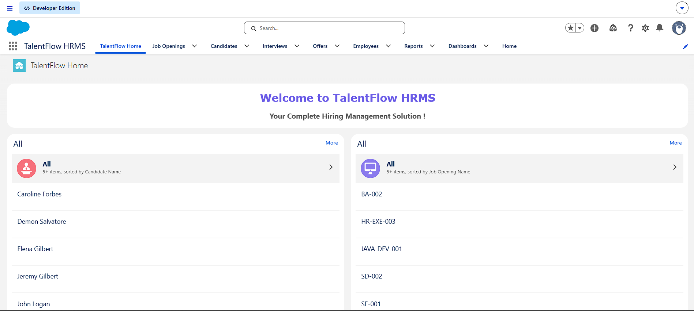

### Dashboard
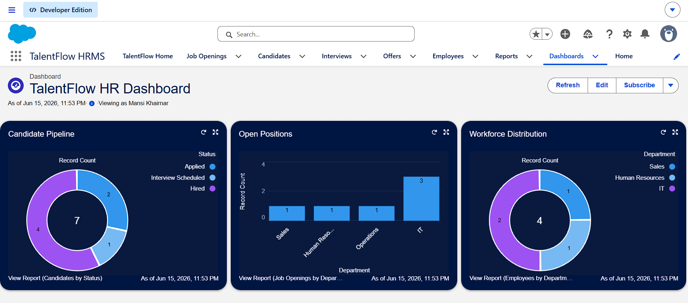

### Candidates List
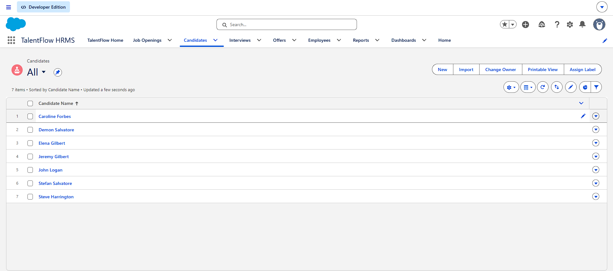

### Flow 1 — Update Candidate Status
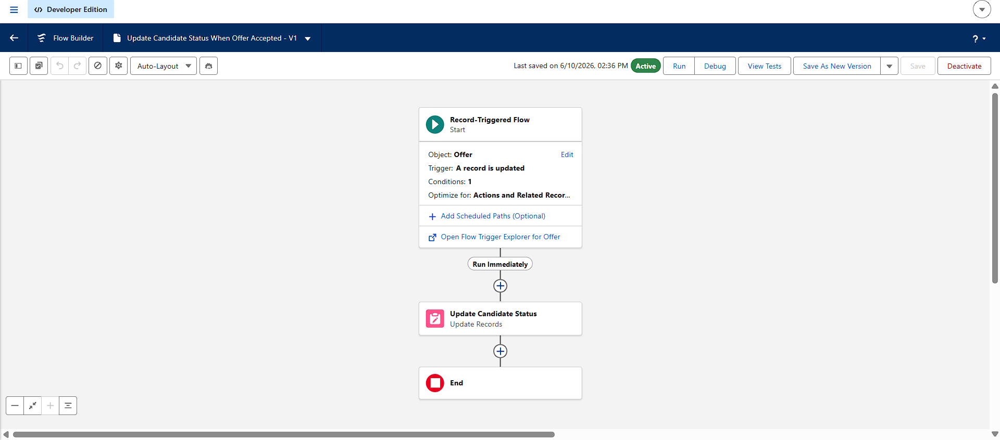

### Flow 2 — Create Employee When Offer Accepted
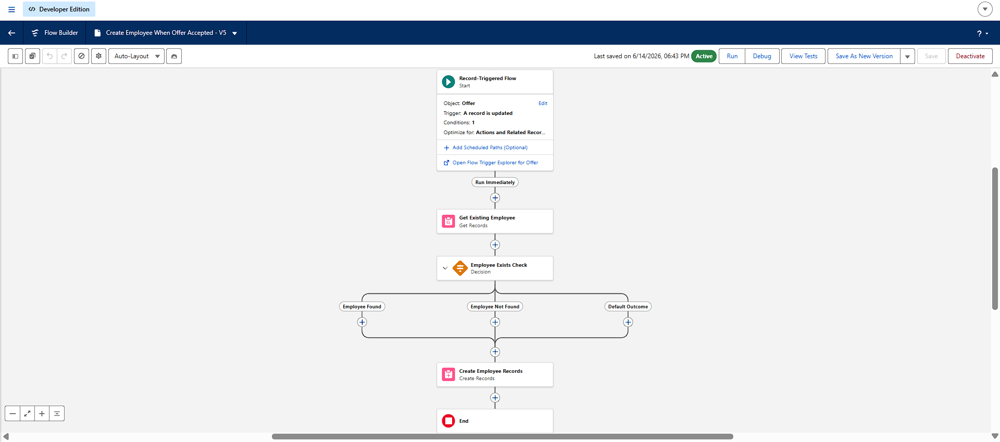

### Approval Process Setup
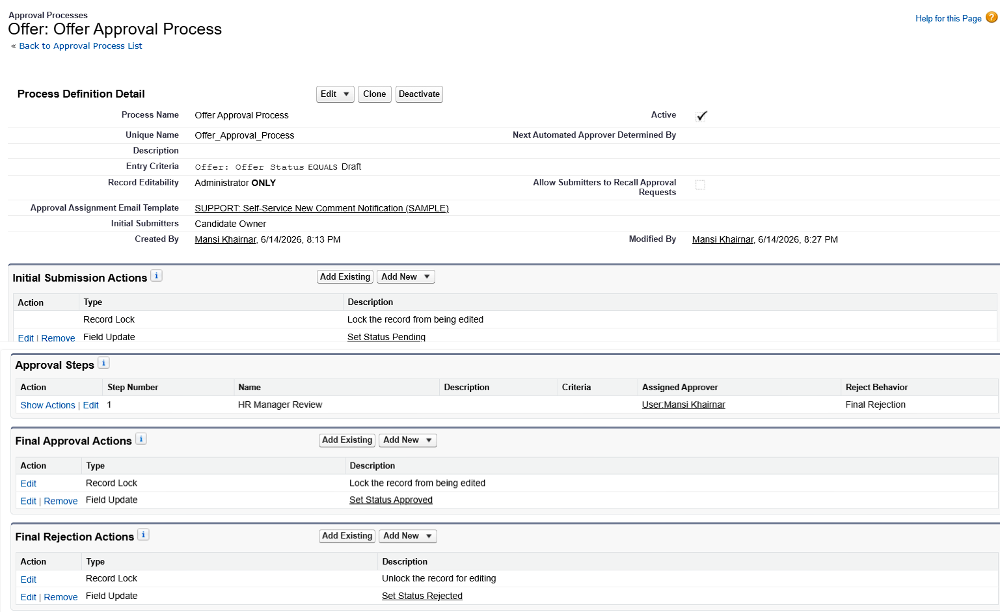

### Approval History — Offer Record
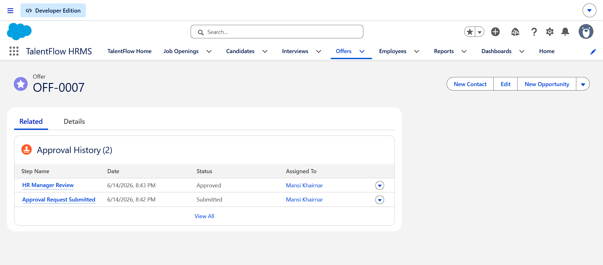

### Validation Rule — Experience Cannot Be Negative
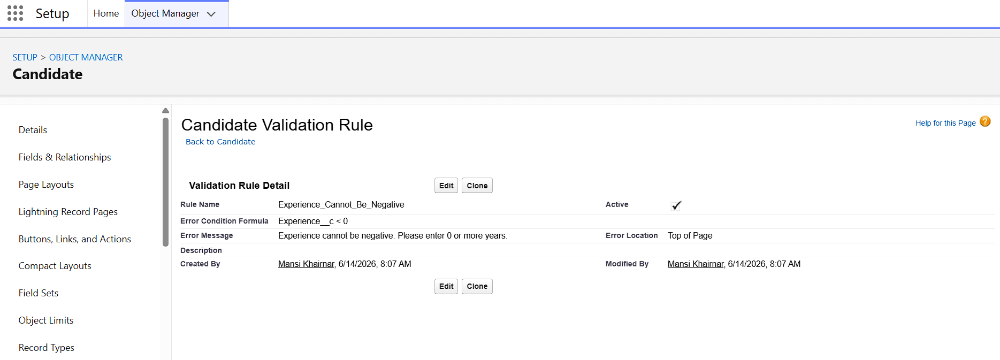

### Validation Rule — Joining Date Cannot Be In Past
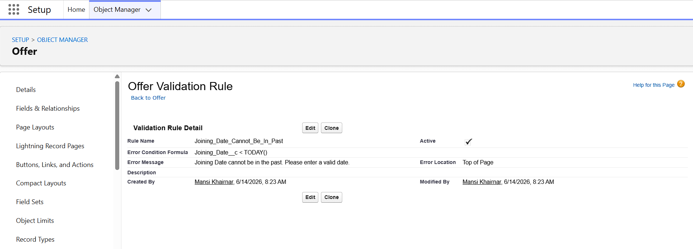

### Validation Error — Experience
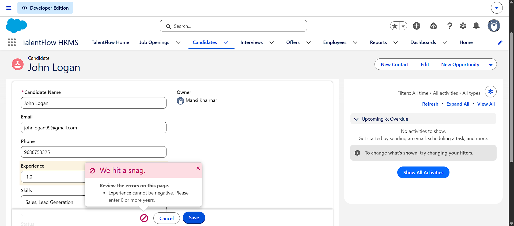

### Validation Error — Joining Date
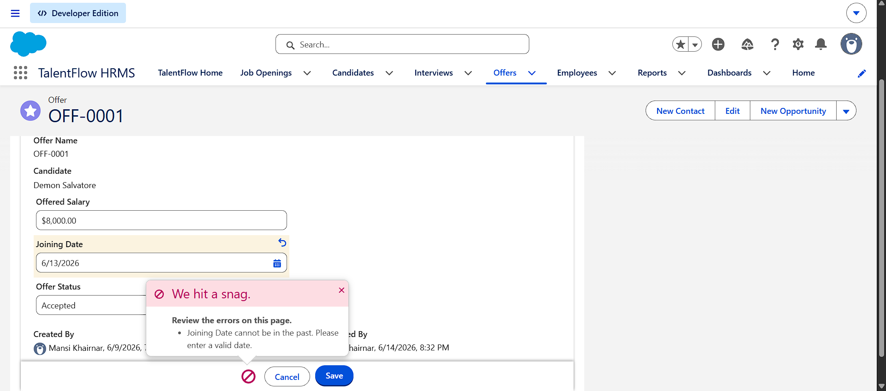

### Reports List
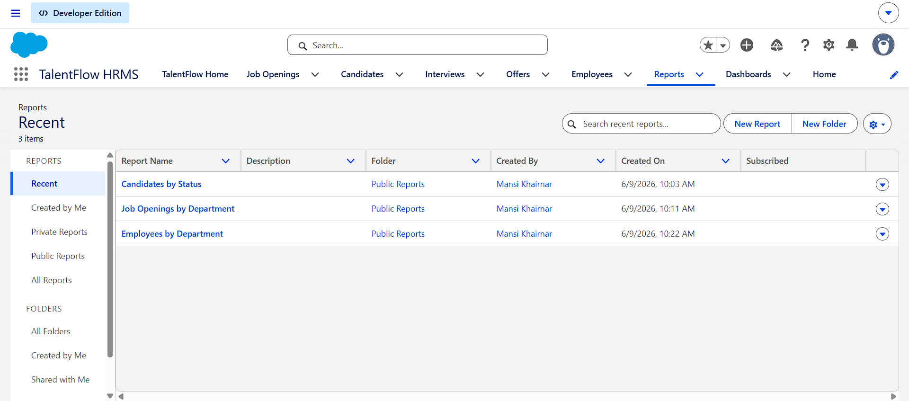

### Candidates by Status Report
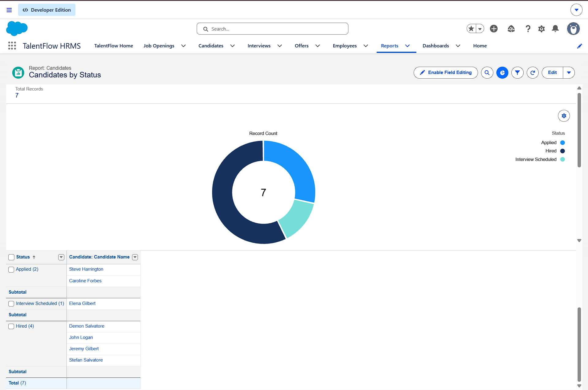

### Candidate Object — Fields and Relationships
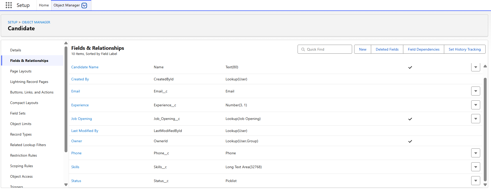

## Tech Stack
- Salesforce Flow Builder — Record Triggered Flows
- Approval Process
- Validation Rules
- Custom Objects and Relationships
- Reports and Dashboards
- Lightning App Builder
- Security Model — Roles and Permission Sets

## Author
**Mansi Khairnar**
[LinkedIn](https://www.linkedin.com/in/mansi-khairnar-m310200k2) | [Trailhead](https://www.salesforce.com/trailblazer/mansi-khairnar)
